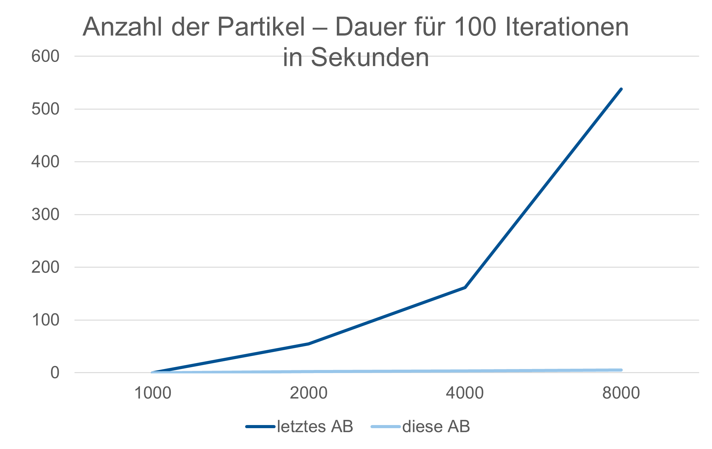

# MolSim-GroupF

The Molecular Dynamics teaching code.

## Getting started
Build the program:
```sh
$ cmake -B build/
$ cmake --build build/
```

Run this worksheet’s simulation:
```sh
$ build/MolSim -y input/assignment4.3_drop.yaml 
```

## Usage
There are two possible ways to configure the simulation settings:

### Over the command line
This passes all necessary parameters over the command line.
The available options are:

| Option                     | Argument | Description                                                                                   |
|:---------------------------|:---------|:----------------------------------------------------------------------------------------------|
| `-o`, `--out`              | `str`    | Path and name of the output files
| `-f`, `--frequency`        | `uint`   | Frequency at which output files are written
| `-w`, `--worksheet`        | `uint`   | Select which worksheet’s simulation to run
| `-e`, `--end-time`         | `double` | Sets the end time
| `-d`, `--delta-t`          | `double` | Sets the timestep
| `-b`, `--brown-motion-avg` | `double` | Sets the average mean for the Brownian motion.
| `-s`, `--single`           | `str`    | Reads particles from the specified file in xyz format
| `-c`, `--cuboid`           | `str`    | Reads particles from the specified file in cuboid format
| `-y`, `--yaml`             | `str`    | Reads particles and settings from the specified file in yaml format
| `-l`, `--loglevel`         | `str`    | Set the log level (trace, debug, info, warn, error)
| `-h`, `--help`             |          | Show a help text and terminates the program.

> [!IMPORTANT]
> When using yaml files with command line parameters, the order of options matters.
> Parameters passed before the YAML file can be overwritten by parameters in the file.

### With YAML Files
YAML files contain all informations for a given scenario and can be read like this:
```
./MolSim -y <input-file> [Options]
```

In general, YAML files allow for more simulation parameters that can not be specified over the command line.
It is recommended to use YAML files.

The structure of a YAML file is following:
```yaml
output:
  folder: "out/" # Where to store xyz/vtk files
  frequency: 10 # After how many iterations output is plotted

# Parameters for running the simulation
simulation:
  worksheet: 3 # Which worksheet's simulation to use
  delta_t: 0.0005 # Timestep to use in the simulation
  end_time: 20 # Time when the simulation ends
  brown_motion_avg_velocity: 0.1 # Average velocity to use in brownian motion
  cutoff_radius: 3.0 # Cutoff radius for LinkedCells simulations
  domain: [180, 90, 1] # Domain for LinkedCells simulations
  #Border Types for the 6 Borders of the Domain.
  #Possible Border Types are: outflow, periodic, naive Reflection, reflection
  #order: x-negative(left), y-negative(bottom), z-negative(back), x-positive(right), y-positive(top), z-positive(front)
  borders: [outflow,outflow,outflow,outflow,outflow,outflow]
  dimension: 2D #2D or 3D Domain
  gravity: -9.81 #Factor of the acceleration of the gravity
  temp_initial: 40 #initial Temperature of the whole system for simulation with thermostat
  temp_final: 40 #Target Temperature for simulation with thermostat -> If not set, it is same to temp_initial
  temp_max_change: 0.5 #maximum change of Temperature in one update step for simulation with thermostat -> If not set, ͩΔT_max = infinity
  temp_frequency: 1000 #Frequency to apply the thermostat to the simulation. If you want to heat or cool the System this value should be small (<= 100) otherwise it can be high

# Instructions to spawn particles
particles:
  # Spawn a single particle
  - single: 
      position: [0.0, 0.0, 0.0] #position of the particle  
      velocity: [0.0, 0.0, 0.0] #initial velocity of a particle
      mass: 1 #mass of the particle
      epsilon: 1.0 #Material specific value to calculate Lennard Jones Forces Correctly
      sigma: 1.0 #Material specific value to calculate Lennard Jones Forces Correctly
  # Spawn a cuboid
  - cuboid:
      position: [20, 20, 0] # Lower left corner of the cuboid
      size: [100, 20, 1] # Number of particles along each axis
      distance: 1.1225 # Distance between particles
      mass: 1 # Mass for each particle
      velocity: [0, 0, 0] # Initial velocity for each particle
      epsilon: 1.0 #Material specific value to calculate Lennard Jones Forces Correctly
      sigma: 1.0 #Material specific value to calculate Lennard Jones Forces Correctly
  # Spawn a 2D-disc on the (x, y) plane
  - disc: 
      position: [70, 60, 0] # Center of the disc
      radius: 15 # Number of particles in each direction
      distance: 1.1225 # Distance between particles
      mass: 1 # Mass for each particle
      velocity: [0, -10, 0] # Initial velocity for each particle
      epsilon: 1.0 #Material specific value to calculate Lennard Jones Forces Correctly
      sigma: 1.0 #Material specific value to calculate Lennard Jones Forces Correctly
  # Spawn a flat membrane, which can be pulled in z-direction at specific particles
  - membrane:
      position: [20, 20, 0] # Lower left corner of the cuboid
      size: [100, 20, 1] # Number of particles along each axis
      distance: 1.1225 # Distance between particles
      mass: 1 # Mass for each particle
      velocity: [0, 0, 0] # Initial velocity for each particle
      epsilon: 1.0 #Material specific value to calculate Lennard Jones Forces Correctly
      sigma: 1.0 #Material specific value to calculate Lennard Jones Forces Correctly
      k: 300 #Stiffness Constant of the Membrane
      r0: 2.2 #Average Bond length of a molecule pair
      f_zUp: 0.8 #Upwards Force, which can be applied to specific particles until time step 150.
      upwards_particles_indexes: [[17,24],[17,25],[18,24],[28,25]] #Indexes of the Particles, to which the Upwards Force f_zUp should be applied.
                                                                   #Indexes are integer Values and describe the position of a Particle.f_zUp: 
                                                                   #e.g. [1,2] is the 2nd particle in x-direction and the 3rd-Particle in y direction of the membran

```

## Build
```
cmake -B build -S . [-D<Build-Option-Name>=<value>]
cd build
make -j <number-of-threads-used-for-compilation>
//or
mkdir build
cd build
ccmake .. //configure build Options
make -j <number-of-threads-used-for-compilation>
```
## Build Options
| Name                    | Argument  Type | Default | Description                                                                                                                                                                                                                                                                                       |
|:------------------------|:---------------|:--------|:--------------------------------------------------------------------------------------------------------------------------------------------------------------------------------------------------------------------------------------------------------------------------------------------------|
| `ENABLE_DOXYGEN_TARGET` | *BOOLEAN*      | ON      | make doc_doxygen will only work if set to ON. If you don't have Doxygen on your machine disable this target                                                                                                                                                                                       |
| `ENABLE_TEST_TARGET`    | *BOOLEAN*      | ON      | ctest will only work if this target is set to ON. You can disable it to make compiling faster, if you don't want to test the code                                                                                                                                                                 |
| `ENABLE_TIME_MEASURE`   | *BOOLEAN*      | OFF     | If this target is set to ON, the program will measure and print the time it took to execute everything. To make this time more statistically significant, the program can be executed mor then one by changing the parameter iterations.                                                          |
| `ITERATIONS`            | *INTEGER*      | 1       | This Target will only be visible, if ENABLE_TIME_MEASURE is set to ON. If you want to execute this program several times, to get better results in measuring the time, you can modify this value.                                                                                                 |
| `ENABLE_VTK_OUTPUT`     | *BOOLEAN*      | OFF     | The program can either generate a .xyz-file or an .vtu-file. Generating the .xyz-file is faster and the output is human readable while .vtu-files can be used do generate a animation with ParaView. .vtu-files will only be generated, if this target is set to ON and if you have installed vtk |


Format the Code
```
make format
```
Get a detailed documentation with doxygen
```
make doc_doxygen
```
Test the Code
```
ctest
```

